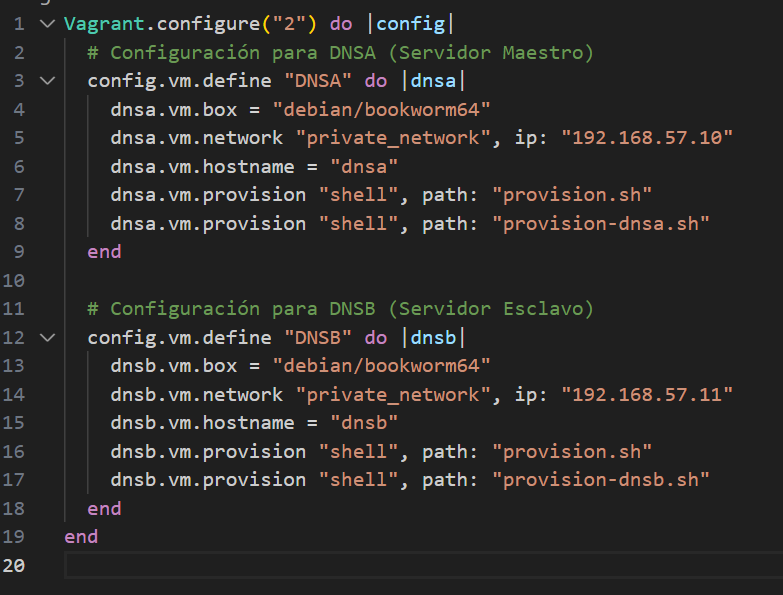
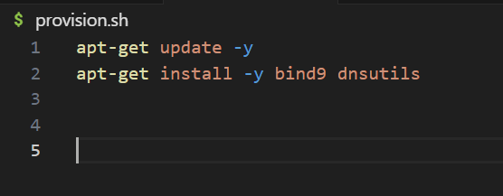
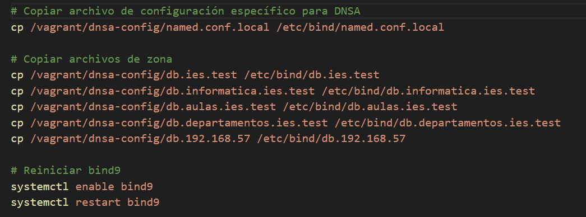
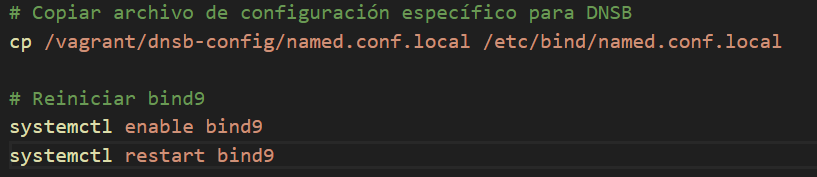
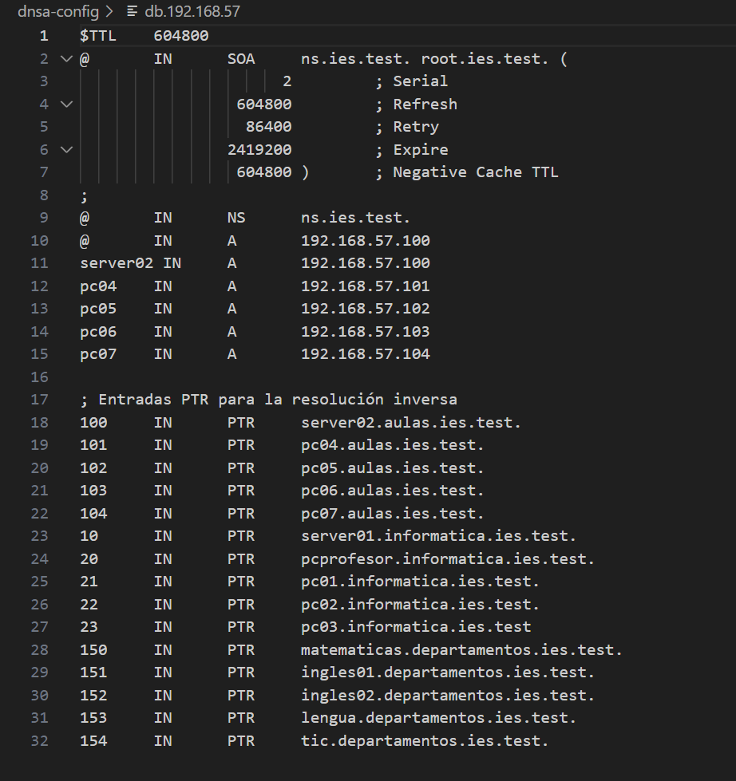
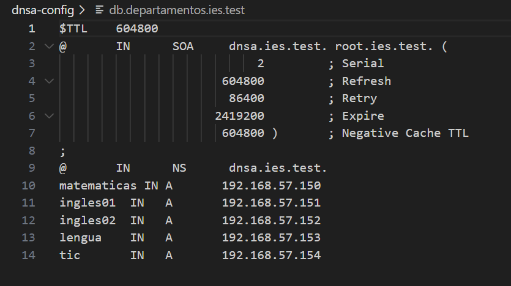
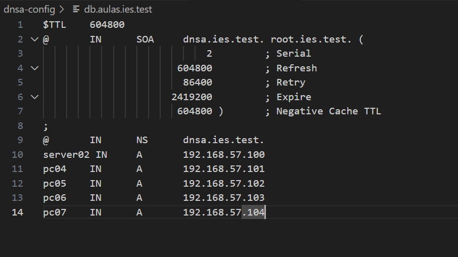
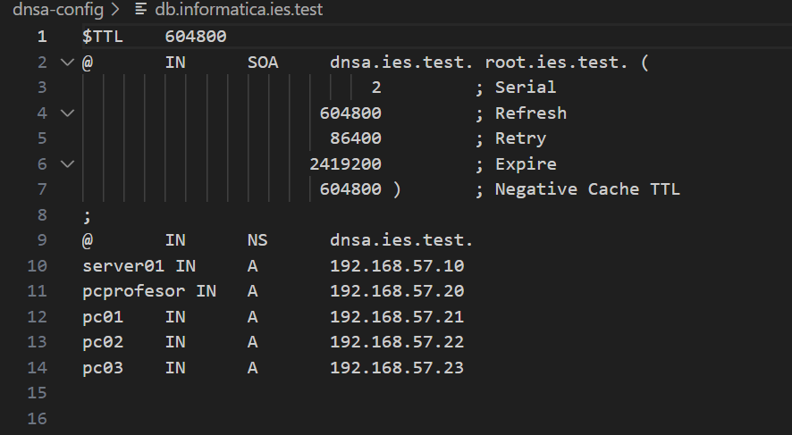
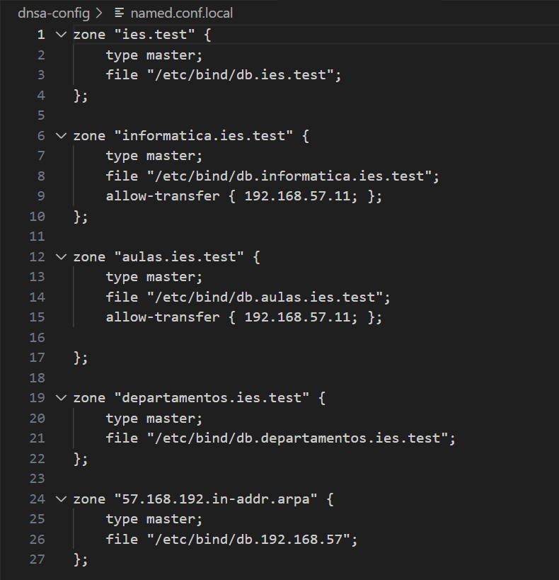
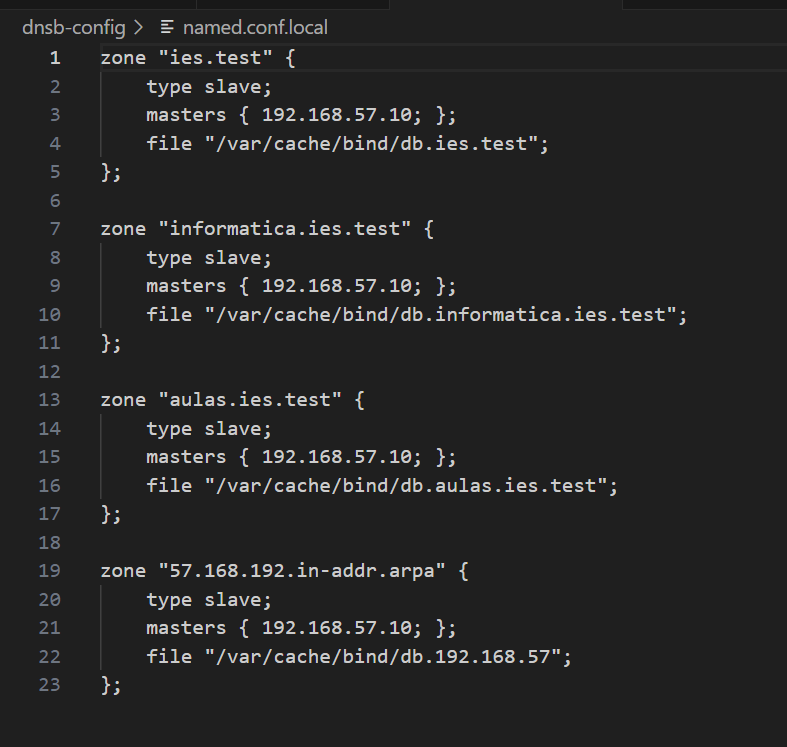

## 1. Creamos el archivo Vagrantfile

## 2. Configuramos los provision.sh
### Provision común

### Provision DNSA

### Provision DNSB

## 3. Configuramos los archivos de zona de DNSA
### db.192.168.57

### db.departamentos.ies.test

### db.aulas.ies.test

### db.informatica.ies.test

### db.ies.test

### named.conf.local

## 4. Configuramos los archivos de zona de DNSB
### named.conf.local

## Pasos a seguir para poner en marcha la práctica
### Abrir la carpeta del proyecto y hacer `vagrant up`

